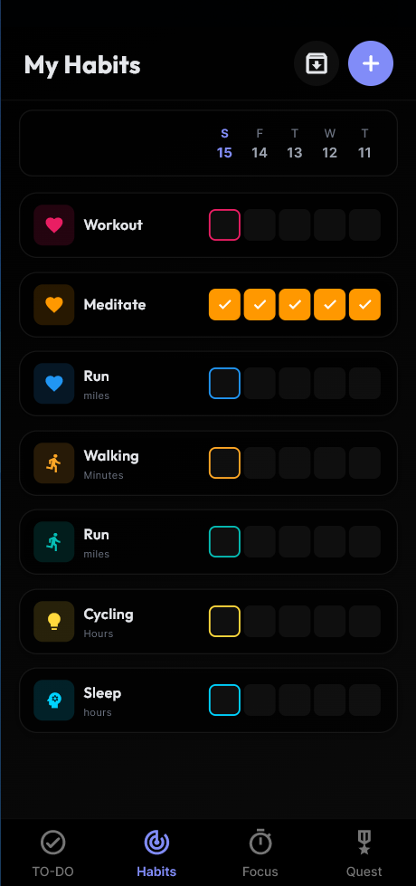
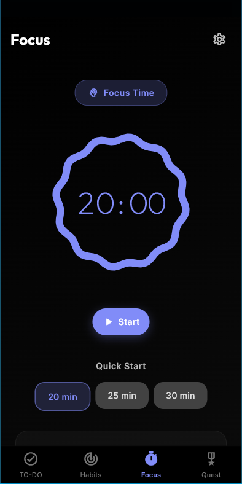
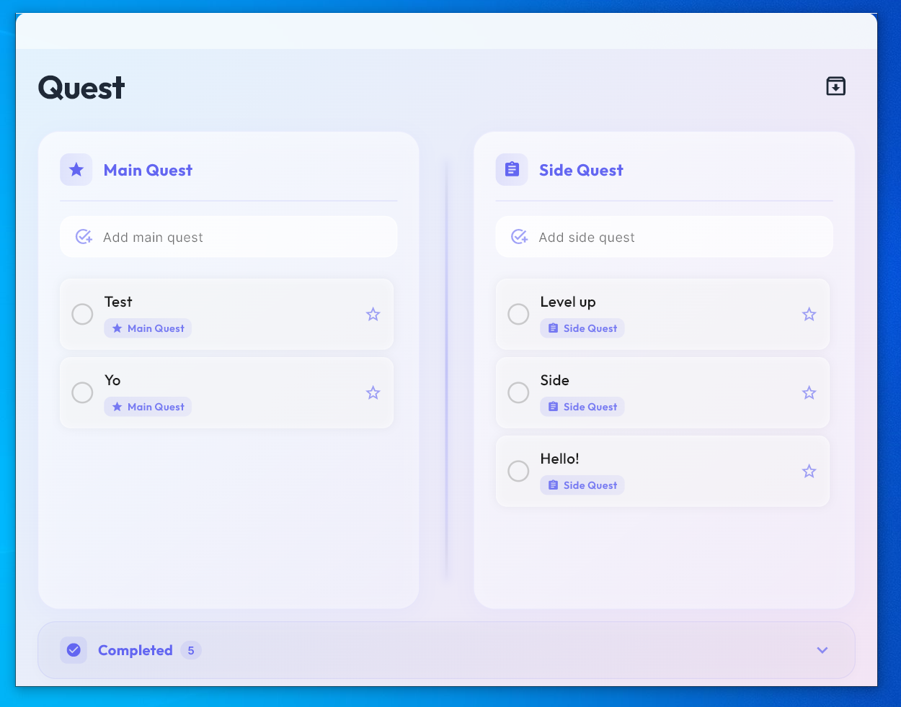

# Quest

**Your life, organized by intent.**

A cross-platform Flutter productivity app that combines task management, habit tracking, and focus tools in one elegant interface. Available on Windows, macOS, Linux, Android, iOS, and Web.

<!-- Screenshots -->
## Screenshots

  
  
  

## Features

- **📝 Todo Management** - Organize tasks efficiently with a clean, intuitive interface
- **✅ Habit Tracking** - Build and maintain positive habits with visual progress tracking
- **🎯 Focus Timer** - Stay concentrated with built-in focus sessions and celebrations
- **🎮 Quest System** - Gamified approach to achieving your goals
- **📦 Archives** - Review completed tasks and habits
- **🎨 Theme Customization** - Personalize your experience with theme options

## Cross-Platform Support

Quest runs seamlessly across all major platforms:

| Platform | Support | Special Features |
|----------|---------|-----------------|
| 🪟 Windows | ✅ | System tray integration, window positioning |
| 🍎 macOS | ✅ | Native experience |
| 🐧 Linux | ✅ | Desktop integration |
| 📱 Android | ✅ | Mobile-optimized UI |
| 📱 iOS | ✅ | Native iOS design |
| 🌐 Web | ✅ | Browser-based access |

<!-- Add platform-specific screenshots -->

  <h3>Multi-Platform Experience</h3>
  
  

## Built With

- [Flutter](https://flutter.dev/) - Cross-platform UI framework
- [Provider](https://pub.dev/packages/provider) - State management
- [Window Manager](https://pub.dev/packages/window_manager) - Desktop window control

## License

This project is licensed under your chosen license - see the LICENSE file for details.
